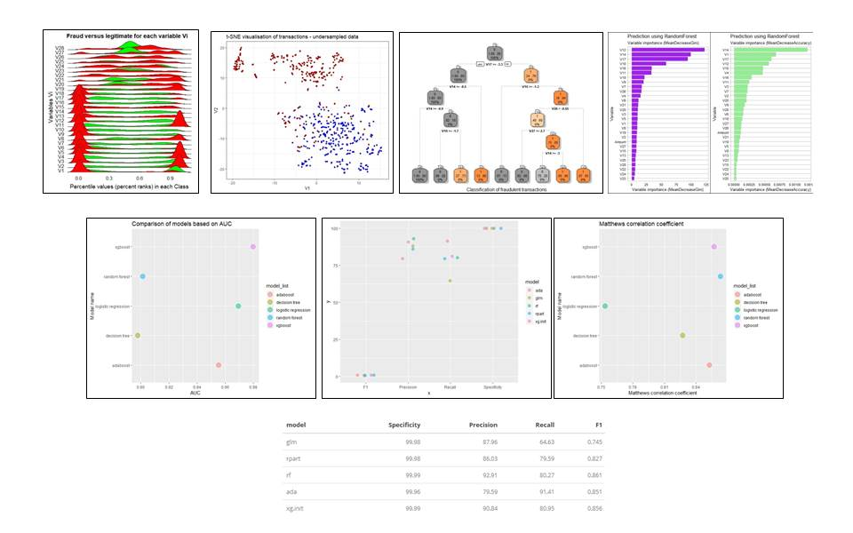

# Fraud_Detection
The supporting code for the fraud detection serie of 5 articles I have written and published on my  blog https://ihh300.github.io/banking/Data-Science-for-Fraud-Detection-Overview/

* Exploratory Data Analysis - fraud
* Using t-SNE, as dimensionality reduction for fraud detection
* Techniques to handle imbalanced dataset
* Comparing ensemble approaches to improve model performance
